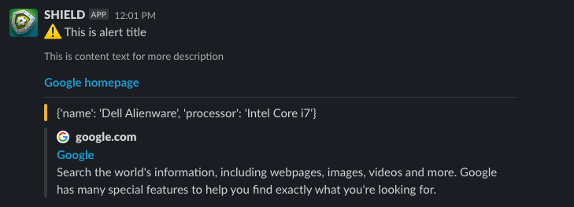
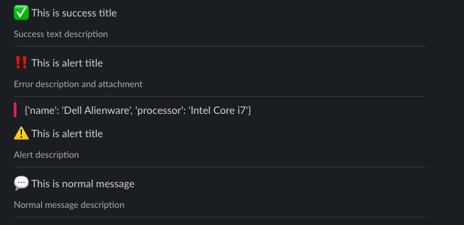

# Slackbot 
</br>

### Setup environment:
App needs to be created at `https://api.slack.com/apps`  

1. `python -m venv env` to create new virtual env

2. `pip install -r requirements.txt` to install dependencies listed in requirements.txt.

3. Setup your `.env` file.

4. This bot uses SlackBolt sdk and block kit.
To start bot run in src  
`python main.py`

5. For exposing api to outside FastApi is used so it needs to be started also. In another terminal:  
`uvicorn api:app --reload`

For development usages, you can import `Dev.postman_collection.json` into Postman  

## Usage:
Send request to `/send_channel_msg`  
Body that can be sent:
```
{
    "title": "This is alert title",
    "text":"This is content text for more description",
    "link":"https://www.google.com",
    "link_title":"Google homepage",
    "image_link":"https://cdn....",
    "priority":3,
    "attachment":{
        "pretext": "Attachment pretext",
        "content": "{'name': 'Dell Alienware', 'processor': 'Intel Core i7'}"
    }
}
```
`link`, `link_title`, `image_link` and `attachment` fields are optional.  
### Priorities:
`0 - normal`  
`1 - alert`  
`2 - error`  
`3 - success`  

## Adding more channels  
Channels are defined through `channels.py`, but their actual keys should be placed
in `.env` file.
1. Add bot to slack channel (you can use @ mention)
2. Add channel id to .env file
3. Add channel to dictionary in `channels.py`

## Preview



